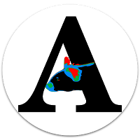

# AnimApp

## Installation

* Open this page in your android browser, download the apk in javacv_tracking_android/app/release/ on to your device and follow instructions
* Download sample files
* Consider running with `Play video` setting to off for faster processing, and turn it on only if you suspect from your resultant graph that the thresholding is incorrect.
* Try using files in sample_videos folder to test. 

IMPORTANT: AnimApp currently works only with small video files (<80MB). If you have larger files, try making them smaller by stripping the audio data and/or reducing the resolution (say, to 640 x 480). `ffmpeg` (https://www.ffmpeg.org/) is a very useful cross-platform tool to achieve this, as well as for converting video formats, croppping, etc. 

## Devices tested

* Nexus 5 (very slow, but works, with large files ~ 75 MB; works faster with smaller files)
* Nexus 5X (emulated)
* OnePlus 5T
* Pixel 2 (emulated)

## Usage instructions

* AnimApp can be typically run in 3 steps:
..1. Load video => set thresholds => crop or set scale by drawing rectangle on image (also select real distance to set scale) => Decide whether to crop to rectangle => Decide whether to play video => Decide whether to play original or thresholded image
..2. Click Next => Wait while video is analysed; frames are counted up and you will see "Done!" at the bottom of the screen.
..3. Click Next => A scatter plot of all positions is generated. Total distance is calculated, and this (along with the scaled distance in cm) is appended to AnimApp_summary.csv in your Downloads folder. All the points, along with the longest and shortest dimensions of the object and angle of rotation are also saved to the video.mp4.csv file (where video.mp4 was the name of the original video), again in the Downloads folder. Moving the slider or editing the number in the box limits the summary analysis to the displayed number of frames. Summary data are appended to AnimApp_summary.csv each time the frame number is modified.
* If you have already run an analysis and would just like to look at the scatter plot or summary analysis, first load the **video** file in step 1 and click Analyse. 

## Contributors

* Srinivasa Rao (code)
* Sam Olechnowicz (artwork, beta testing)
* Patrick Kraetschmer (beta testing) @PatrickK 
* Narayana Rao (code)
